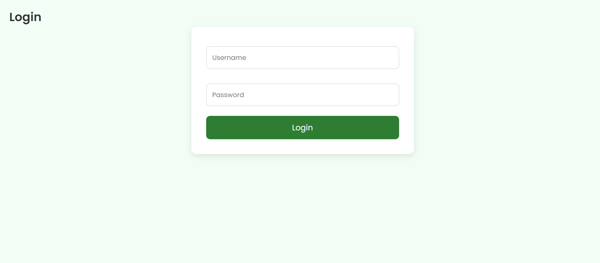
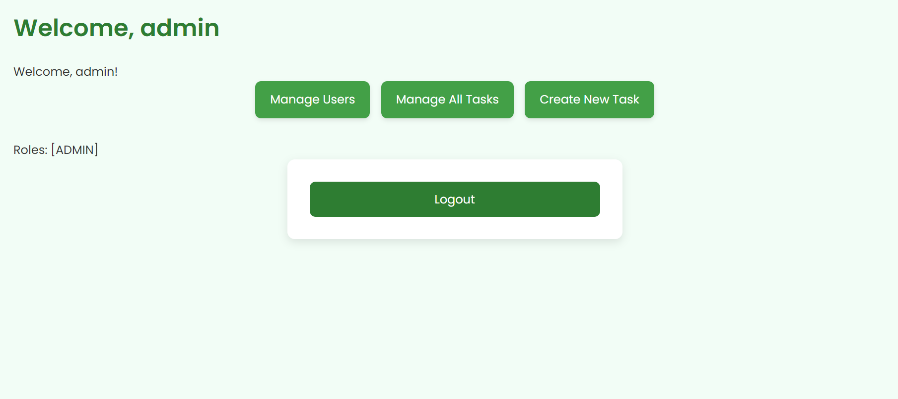
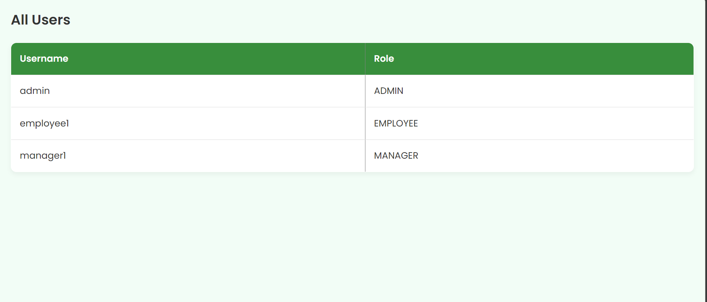
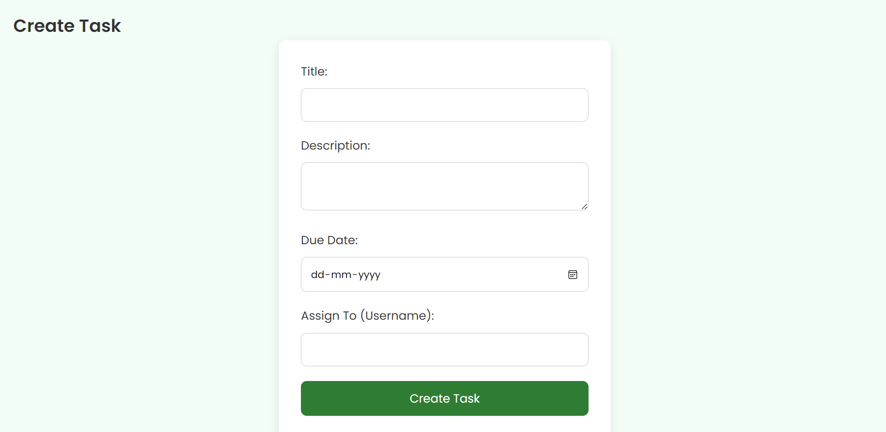
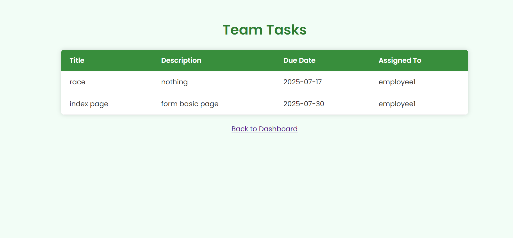
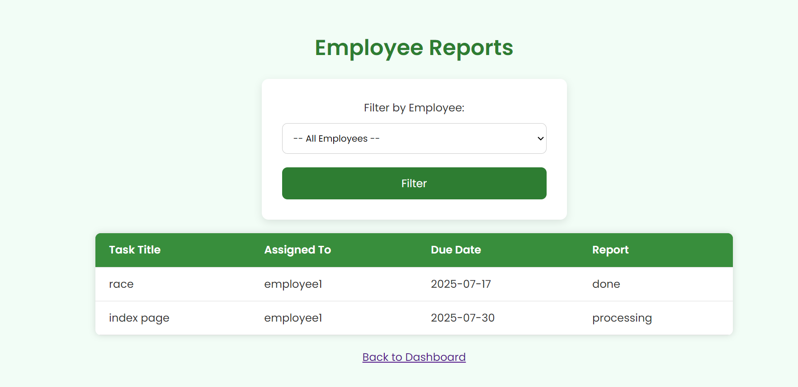
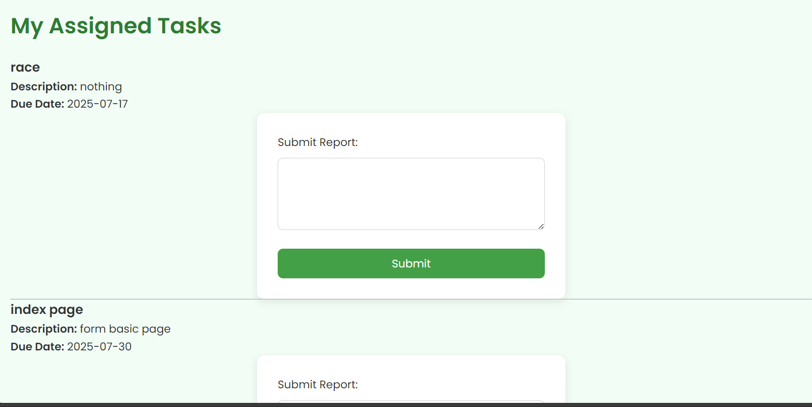
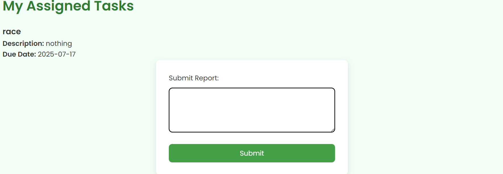

# POLP — Role-Based Access (Spring Boot 3 + Spring Security 6, Thymeleaf)

This project demonstrates **Principle of Least Privilege (POLP)** using **role-based access control** with Spring Security.
It includes multiple HTML (Thymeleaf) pages and restricts routes for **EMPLOYEE**, **MANAGER**, and **ADMIN** roles.

---

## ✅ What’s in this project
- **Port:** `8085`
- **DB:** MySQL `employee_task_db`
- **Roles:** `EMPLOYEE`, `MANAGER`, `ADMIN`
- **Login/Logout:** Custom login page at `/login`, logout redirects to `/login?logout`
- **Password hashing:** BCrypt
- **Thymeleaf templates:** `login.html`, `dashboard.html`, `admin-*.html`, `manager-*.html`, `employee-*.html`, `task-create.html`

**Access rules (from `WebSecurityConfig`):**
```java
.requestMatchers("/admin/**").hasRole("ADMIN")
.requestMatchers("/manager/**").hasRole("MANAGER")
.requestMatchers("/employee/**").hasRole("EMPLOYEE")
.requestMatchers("/login", "/css/**").permitAll()
.anyRequest().authenticated()
```

---

## 🧭 Routes & Pages

### Public
- `GET /login` → `login.html`
- `GET /` or `GET /dashboard` → `dashboard.html` (requires auth in your config; adjust if you want it public)

### Admin-only (`/admin/**`)
- `GET /admin/tasks` → `admin-tasks.html`
- `GET /admin/tasks/create` → `task-create.html`
- `POST /admin/tasks/create` → create task
- `GET /admin/users` → `admin-users.html`

### Manager-only (`/manager/**`)
- `GET /manager/team-tasks` → `manager-team-tasks.html`
- `GET /manager/reports` → `manager-reports.html`

### Employee-only (`/employee/**`)
- `GET /employee/my-tasks` → `employee-my-tasks.html`
- `GET /employee/report/submit` → `employee-submit-report.html`
- `POST /employee/submit-report` → submit report
- `GET /employee/reports` → `employee-reports.html`

---

## ⚙️ Configuration

`src/main/resources/application.properties` in your project currently contains:
```properties
spring.application.name=polp
server.port=8085

# database
spring.datasource.url=jdbc:mysql://localhost:3306/employee_task_db
spring.datasource.username=root
spring.datasource.password=root
spring.jpa.hibernate.ddl-auto=update
spring.jpa.show-sql=true
spring.jpa.properties.hibernate.dialect=org.hibernate.dialect.MySQL8Dialect

spring.thymeleaf.cache=false
spring.h2.console.enabled=false
```

**Recommended for GitHub:** commit a sanitized example file:
`application.properties.example` (provided below) and keep secrets local.

---

## ▶️ How to run
```bash
./mvnw spring-boot:run       # macOS/Linux
mvnw.cmd spring-boot:run     # Windows
```
Go to **http://localhost:8085**

> If you don’t have users yet, create them via a simple CommandLineRunner or a form; ensure passwords are **BCrypt** hashed and roles set to one of: `EMPLOYEE`, `MANAGER`, `ADMIN`.

---

## 🖼️ Screenshots
Place PNGs in `polp-role-based-access/assets/` so they render here.












See **assets/SCREENSHOTS_GUIDE.md** for exact URLs to open each page before capturing.

---

## 🛠️ Troubleshooting
- **403 Forbidden** → your user doesn’t have the required role; log in as the correct role.
- **Login loop** → check that you POST to Spring Security’s login endpoint or the form’s action matches.
- **No users** → seed users with BCrypt passwords and proper roles.
- **Thymeleaf cache** is disabled for development (`spring.thymeleaf.cache=false`) so edits reflect immediately.

---

## 📁 Suggested repo placement
```
springboot-learnings/
└── polp-role-based-access/
    ├── pom.xml
    ├── src/...
    ├── README.md
    ├── .gitignore
    ├── application.properties.example
    └── assets/
        └── SCREENSHOTS_GUIDE.md
```
