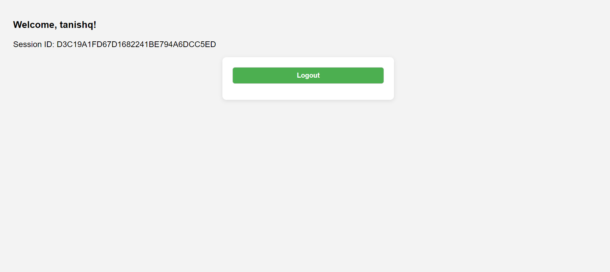
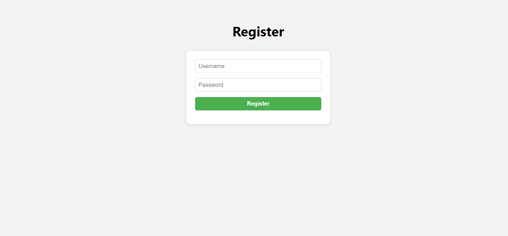

# Session-Based Authentication — Spring Boot 3 + Spring Security 6 (Thymeleaf)

This project demonstrates **stateful session-based login** with Spring Security and Thymeleaf pages.

**Detected from your project:**
- Port: **8084**
- Session timeout: **2m**
- HTML templates found (6): home.html, login.html, register.html, home.html, login.html, register.html

---

## ▶️ How to Run
```bash
./mvnw spring-boot:run       # macOS/Linux
mvnw.cmd spring-boot:run     # Windows
```
App will start at **http://localhost:8084**.

---

## ⚙️ Configuration (example)
Create `src/main/resources/application.properties` like:
```properties
server.port=8084
server.servlet.session.timeout=2m

spring.datasource.url=jdbc:mysql://localhost:3306/sessiondb
spring.datasource.username=root
spring.datasource.password=root
spring.jpa.hibernate.ddl-auto=update
spring.jpa.show-sql=true
spring.jpa.properties.hibernate.dialect=org.hibernate.dialect.MySQL8Dialect
```

> Replace credentials for public repos and consider committing `application.properties.example` instead.

---

## 🧭 Pages
The project includes these Thymeleaf views:
- `home.html`
- `login.html`
- `register.html`

Typical endpoints:
- `/register` (GET/POST)
- `/login` (GET, Spring handles POST)
- `/home` (secured; shows username + session ID)
- `/logout` (POST; invalidates session)

---

## 🔒 Notes
- Use **BCrypt** for passwords
- Keep **CSRF enabled** for forms
- Spring Security provides **session fixation protection** by default

---

## 🖼️ Screenshots
Add PNGs for each page here so the README renders them:


 

See **assets/SCREENSHOTS_GUIDE.md** for exact instructions and URLs per page.

---

## 📁 Suggested repo placement
```
springboot-learnings/
└── session-management/
    ├── (your project files)
    ├── README.md
    ├── .gitignore
    ├── application.properties.example
    └── assets/
        └── SCREENSHOTS_GUIDE.md
```
